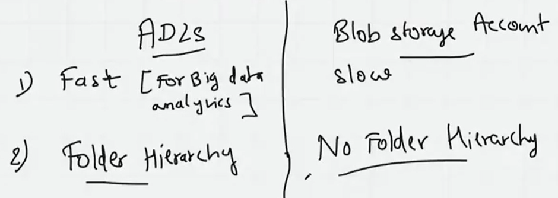
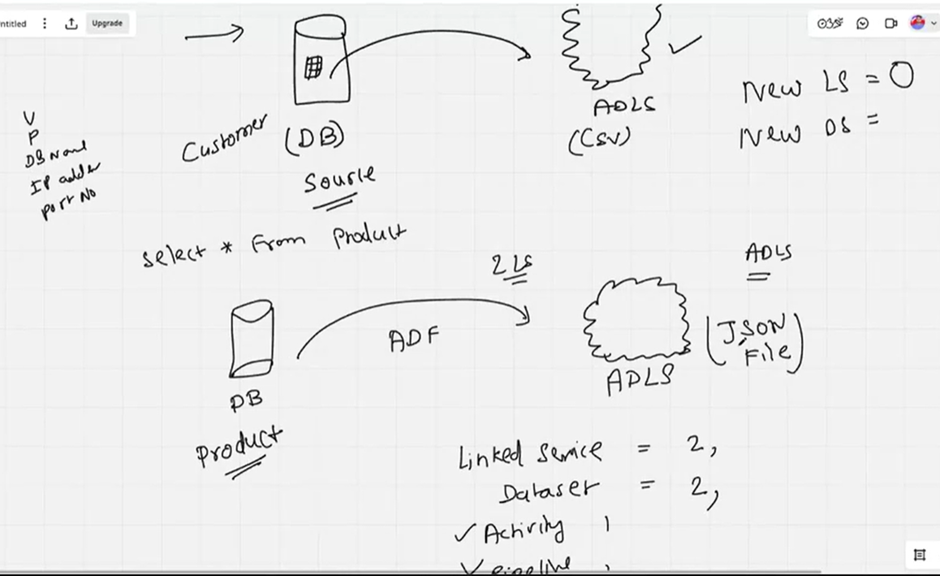
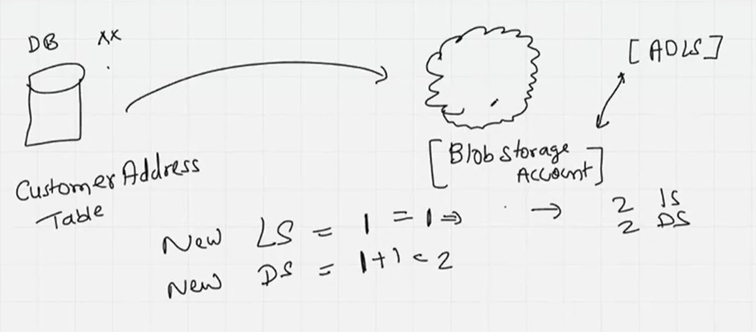

# ADLS & Blob Storage:

Blob service is a flat file service; if I delete a file, it will delete the folder too (Add Directory). Whereas, in ADLS Azure Data Lake Storage, it remains.
If I’m going to use it for analytics purposes, use ADLS.

ADLS is more costly than Blob storage. Although storage is not very expensive, check using the Azure price calculator- add to estimate.

## Encryption:

In the cloud: For example, in the company, I wouldn’t have administrator access; the same happens in the cloud. The best practice to create resources is in the hands of the admin. My job is to use the resources, not create.

1.	Encryption happens 2 ways: 
    - At the rest, and at the transit.
2.	Role-based access control (RBAC)
3.	SAS (Shared access signature) Token – limited time access control
4.	Access keys – Full access

### The other methods of storage are:
  - File share: such as sharing drives.
  - Queue: sender -receiver -notifications
  - Table – NoSQL – DynamoDB

### DE Toolkit in the Azure world:
        - Orchestration tool – ETL Tool – Azure Data Factory (ADF) – No code / low code.
        - Configuration – Drag & drop.
        - Analysis engine – Py Spark, Databricks (Common).
        - Modelling – Dimension modelling, star/snow schema.

### DE Toolkit in the AWS world:
        - Orchestration tool – ETL Tool – AWS Glue, Airflow (Open source), Informatica.
        - Analysis engine – Py Spark, Databricks (Common).
        - Modeling - Dimension modelling, star/snow schema.
            - The rest are not cloud-specific.

### In terms of Linked Services:

1. Ask yourself, is there any change in source or target, such as a password or access control, than need to create a new LS, otherwise not.
2. If it’s not the same format when copying, for example, from csv to JSON, we need to create a new dataset.
3. Can I reuse the linked service I created earlier if it matches the new requirements? 

4. If the datasets and file format match, I don’t need to create a new LS; otherwise, reuse the existing one.

