# End-to-end ETL pipeline created in Azure Data Factory.
This document will show you how to create an end-to-end ETL pipeline in Azure Data Factory. The pipeline will extract data from a source, transform it, and load it into a destination.

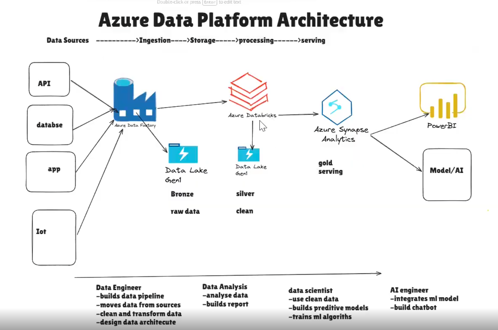

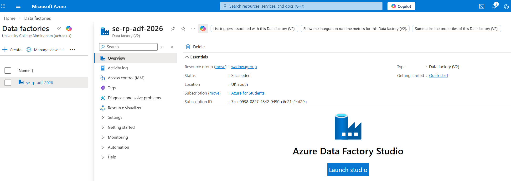

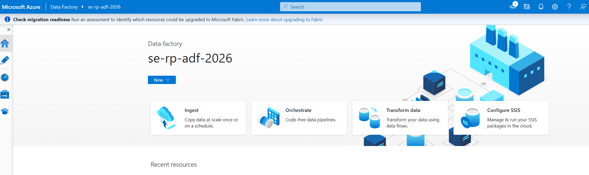

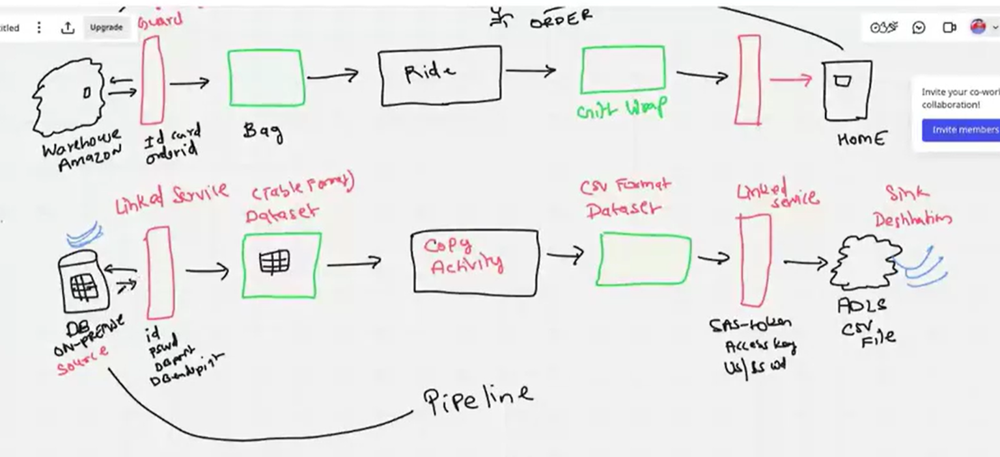

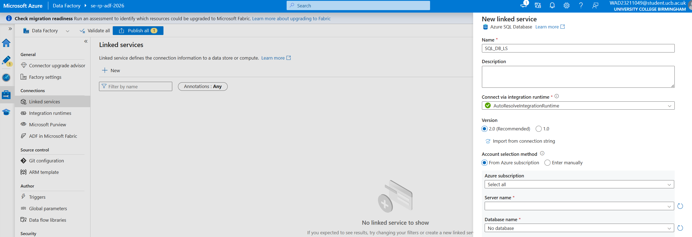

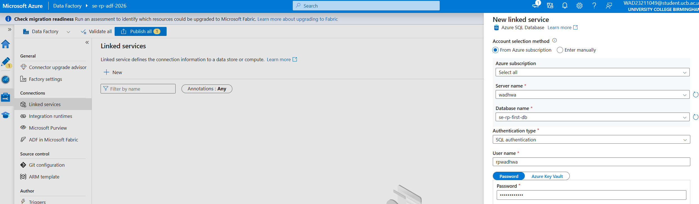

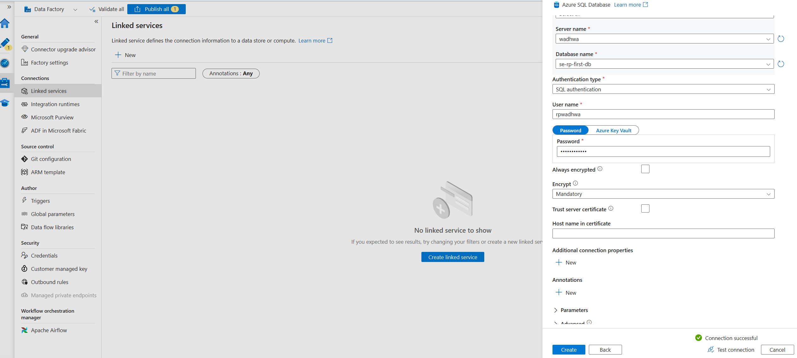

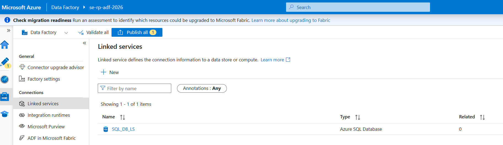

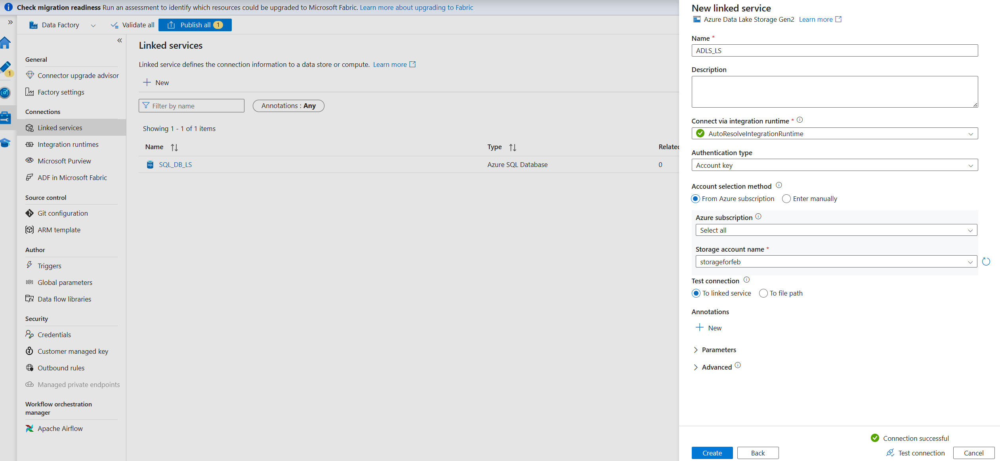

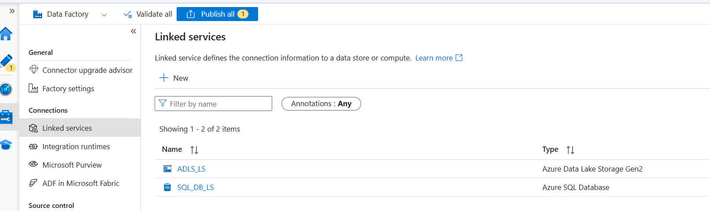

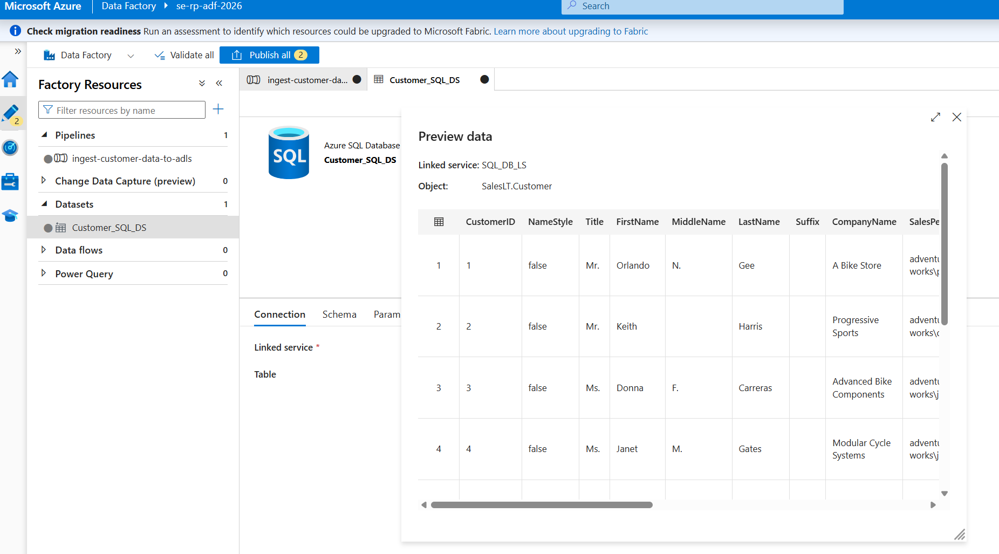

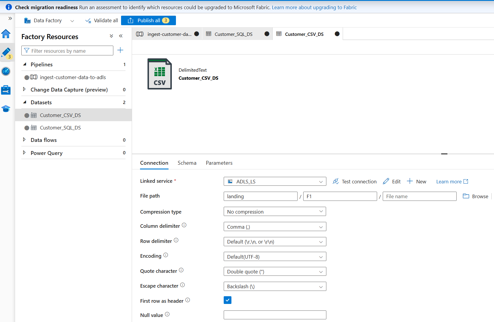

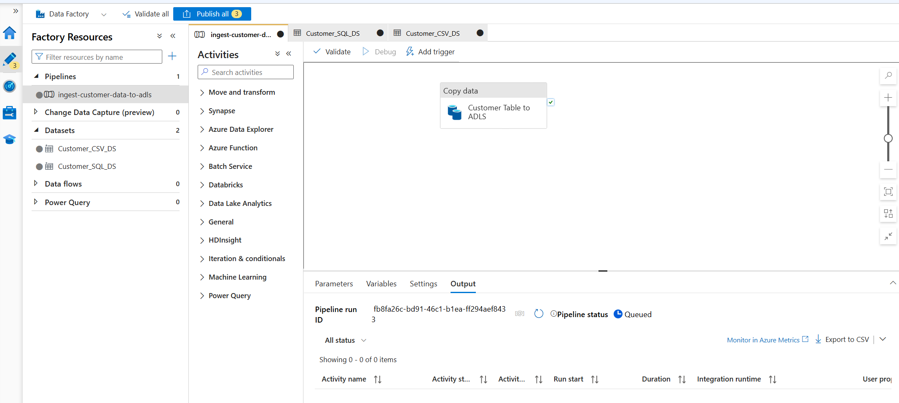

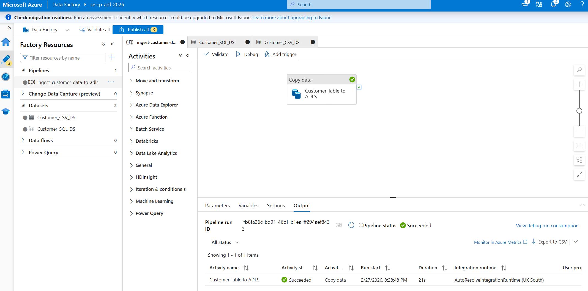

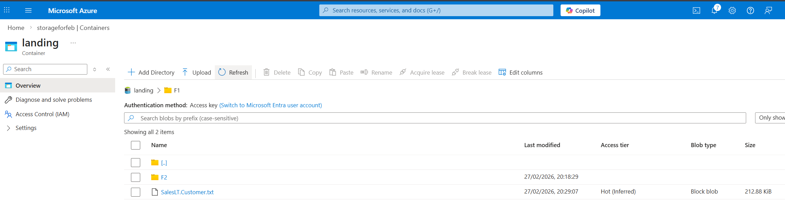

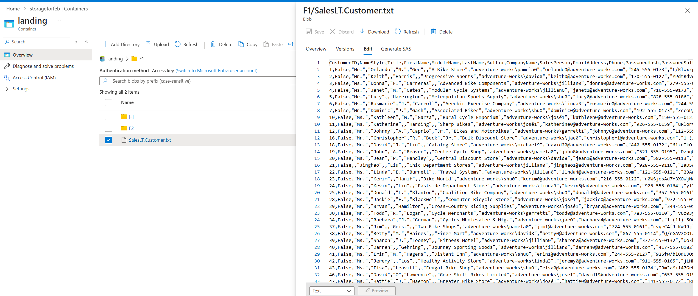

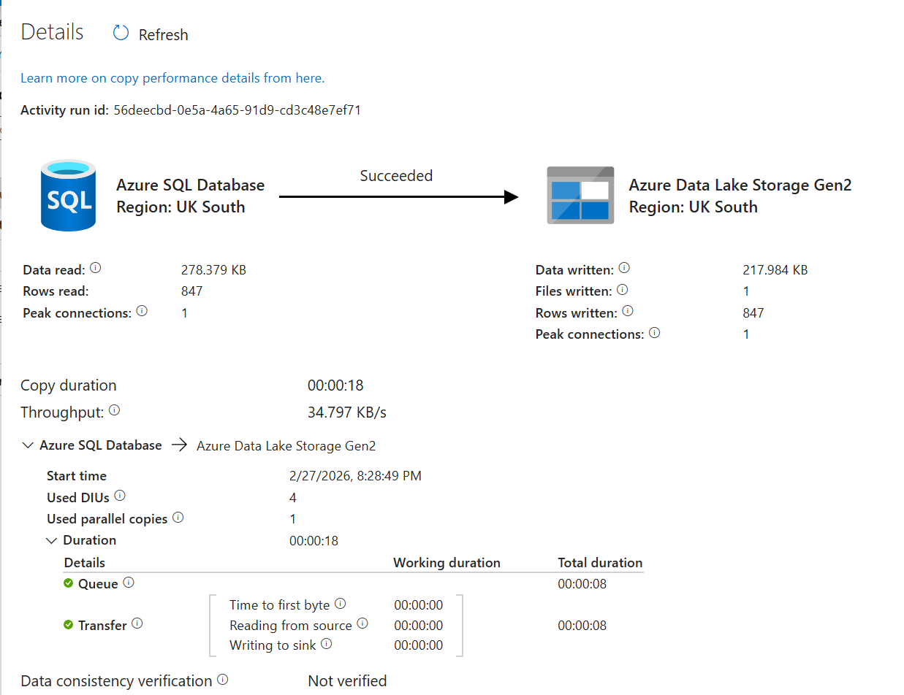

### Finally click on 'Publish all' as it won't save automatically.
