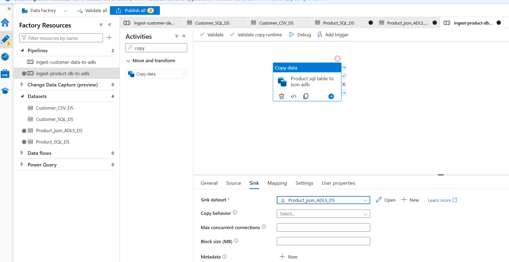

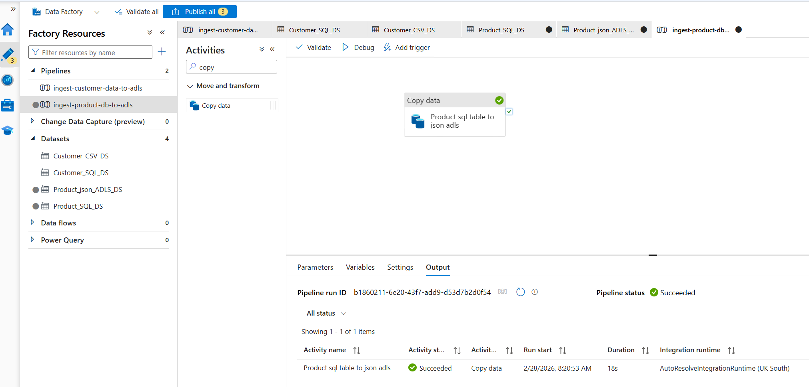

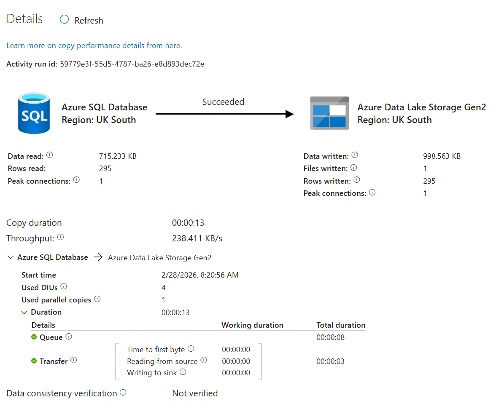

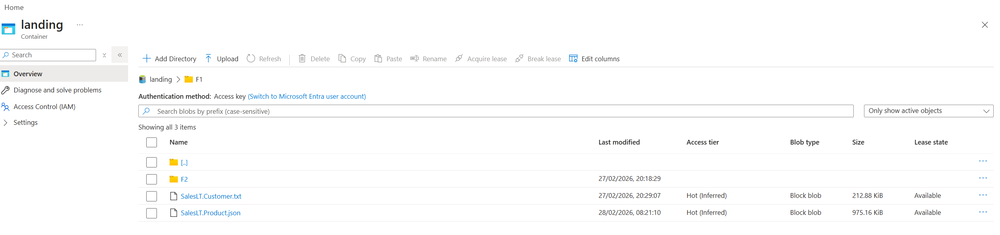

## Ensure to publish it as it won't be saved automatically.

- If you want to make changes to the product, you can click on the pencil icon and edit the product details. After making the necessary changes, remember to publish it again to save the updates.

- If you want to delete the product, click on the trash bin icon. A confirmation prompt will appear. Confirm the deletion to remove the product from your list.

- If you want to view the product details, click on the eye icon. This will take you to a page where you can see all the information about the product, including its status, storage details, and any other relevant information.

Cost comes from the execution times. Putting two many table in one pipeline is not a best practice. However, it's possible. In case error occured in one of the table, I'll have to go through to debug which one caused the error, which would be time consuming. Meaning, upto a few tables (4-5) it's ok. However, avoid combining two many.

### Ingested both tables in the same pipeline, pay attention to the execution time.

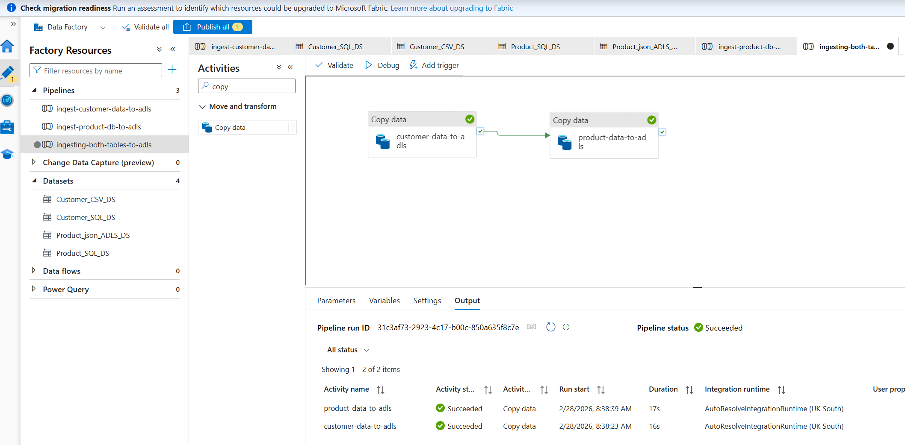

Published/deployed changes to the Data Factory.

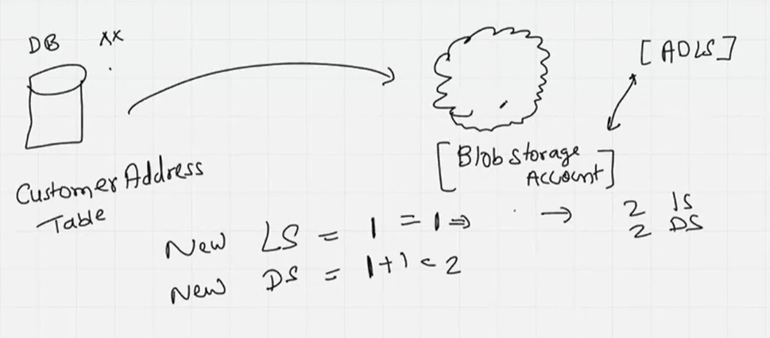

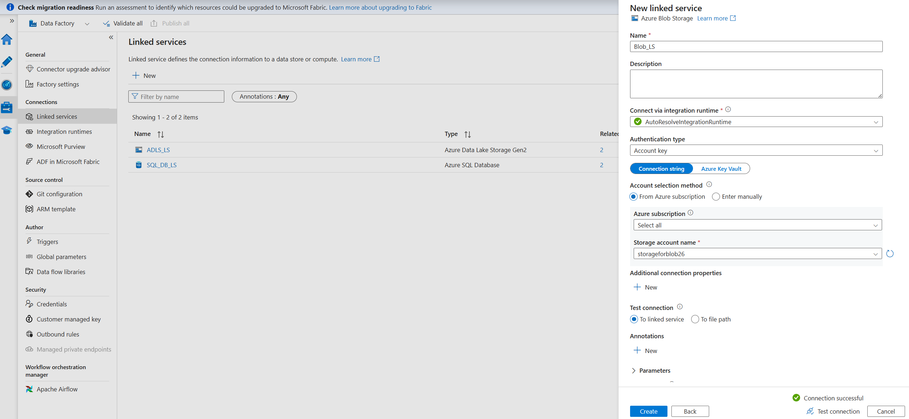

### Generally, Parquet file is not readable as it's in a different format. However, data is there as file appeared up in Blob Storage.

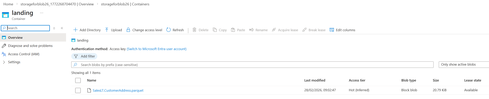

### Query method rather than using the whole table such as column names or some conditions.

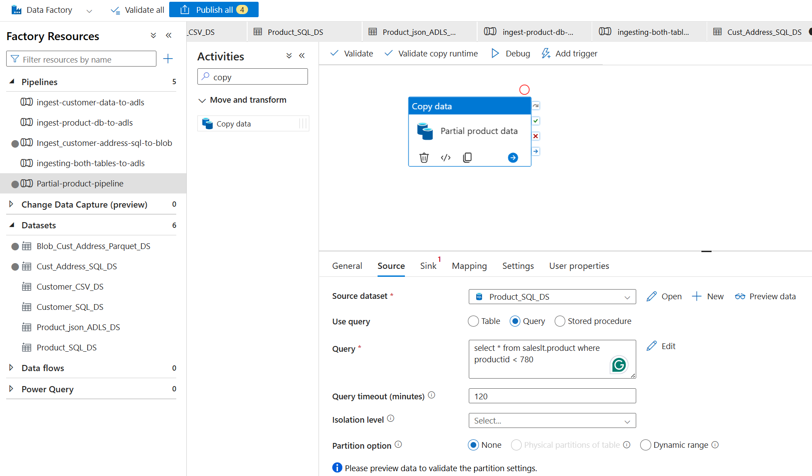

- It succeeded, let's observe the rows.

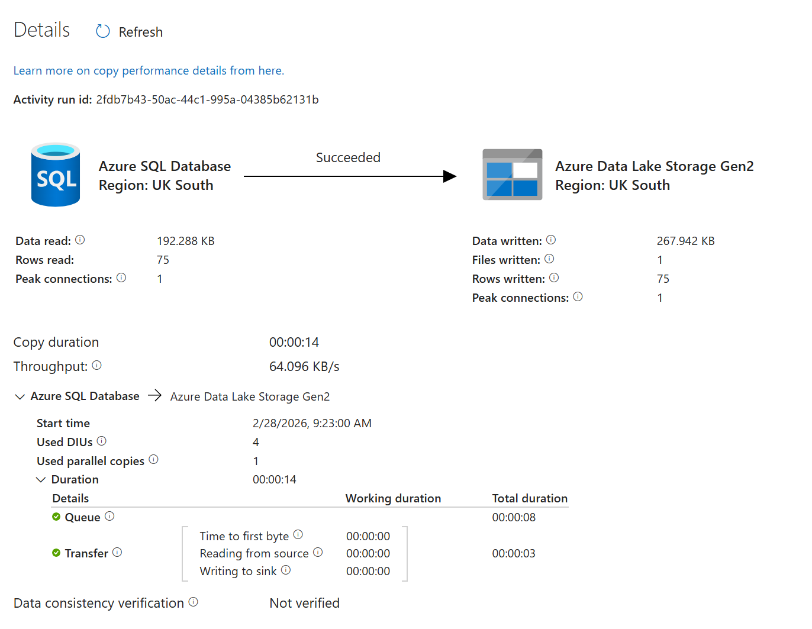

- It worked, we can see the rows in the output.

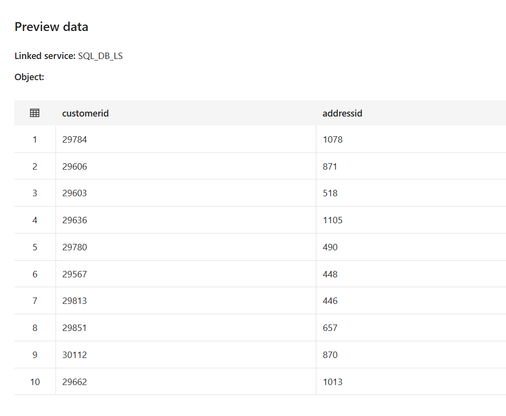

Now, the question is, can I use different dataset? No, as I change the dataset the option below changes too.

### Different Scenario:

    - Lookup is not copying anything which is why no option for source or sink available.
    - The main goal is here to get a small piece of information.
      
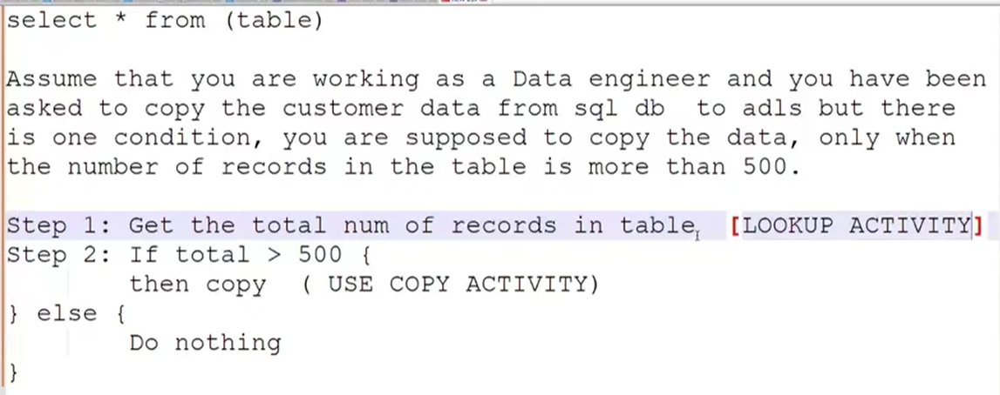

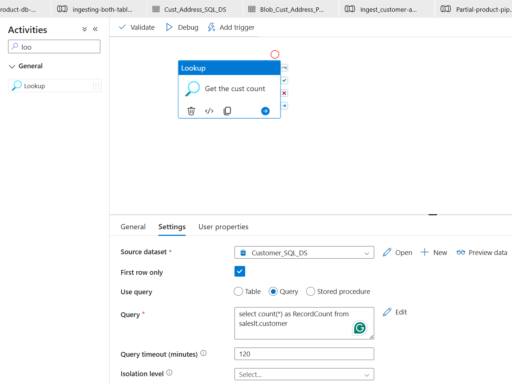

- That output in preview gives me the record count as shown below.
  
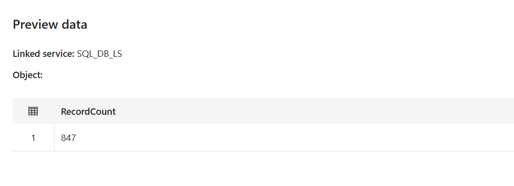

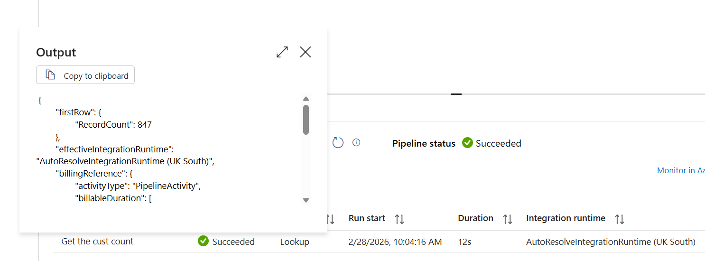

- Now, I can use that output in the next activity which is ForEach loop. I can use the output of the lookup as an input for the ForEach loop and then inside the ForEach loop, I can use a copy activity to copy the data from the source to the destination.

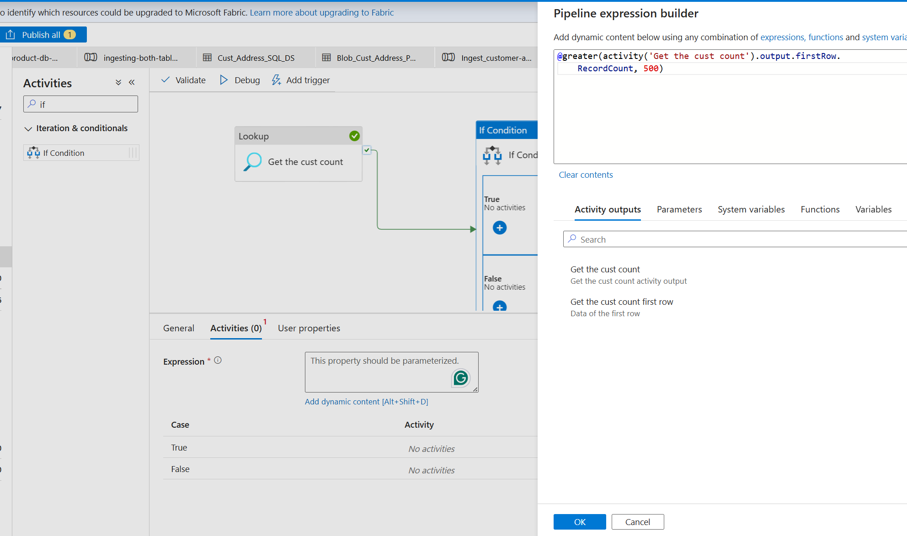

- In the ForEach loop, I can use the output of the lookup to iterate through the records and perform the copy activity for each record.
  
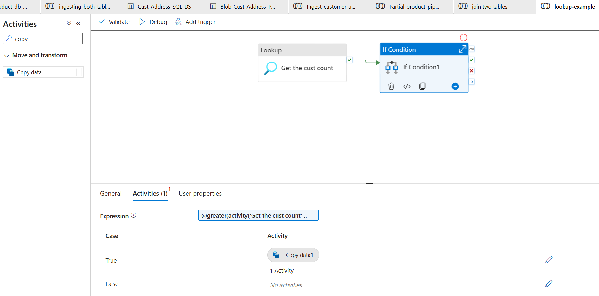

- It succeeded, let's check the output in the destination.
- That's how I made this dynamic by adding small logic. 
  
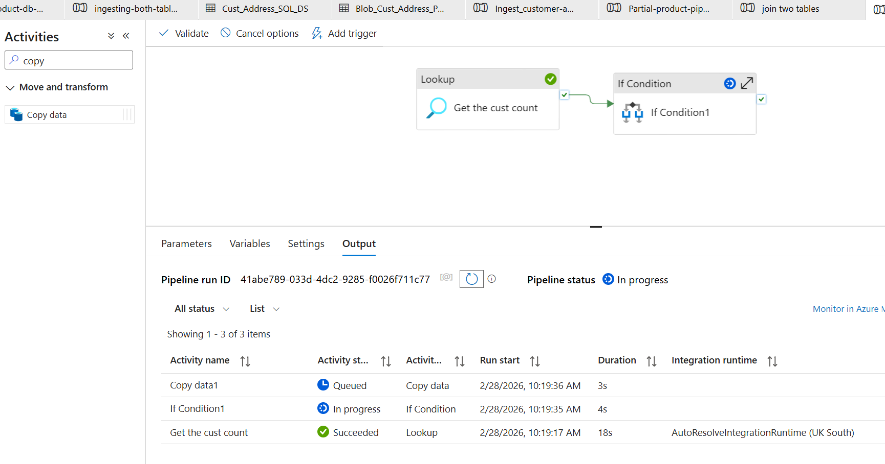

- I can see the data in the destination as well.
  
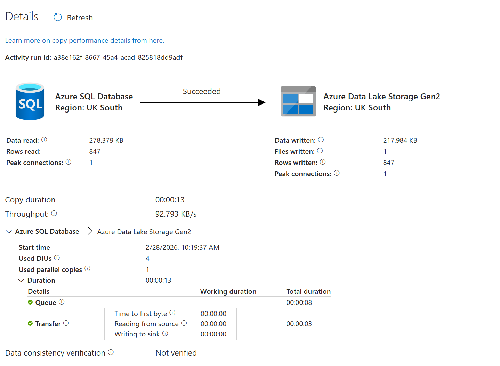
