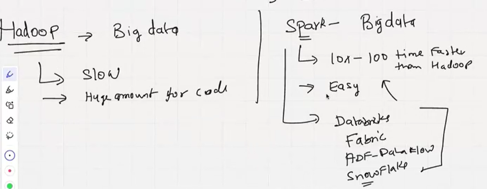
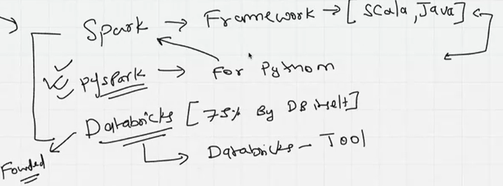
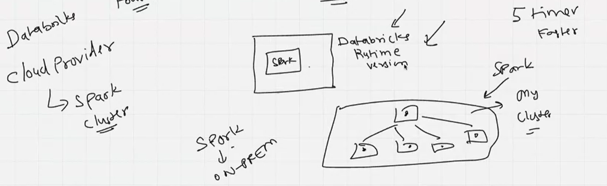
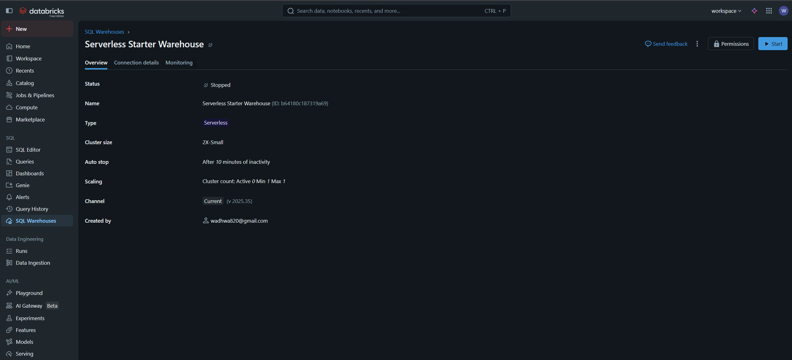

# Introduction to Spark, PySpark, Databricks for Parrallel distribution computing. Created a free databricks account, which is a next step to learn and excel.
- The purpose and benefit of Spark and other tools for big data.

## Databricks is a unified analytics platform that provides a collaborative environment for data engineering, data science, and machine learning. It is built on top of Apache Spark and offers a cloud-based platform for big data processing and analytics.

- Node (Machines, Laptop), Cluster = Group of connected nodes.
  

### Databricks provides a collaborative workspace where data engineers, data scientists, and analysts can work together on data projects. It offers features such as notebooks, dashboards, and collaboration tools that enable teams to share code, insights, and visualizations.

- Account created, ready to explore:

### Databricks also provides a managed Spark environment, which means that users can focus on their data processing and analytics tasks without worrying about infrastructure management. It offers features such as auto-scaling, optimized performance, and integration with various data sources and tools.

